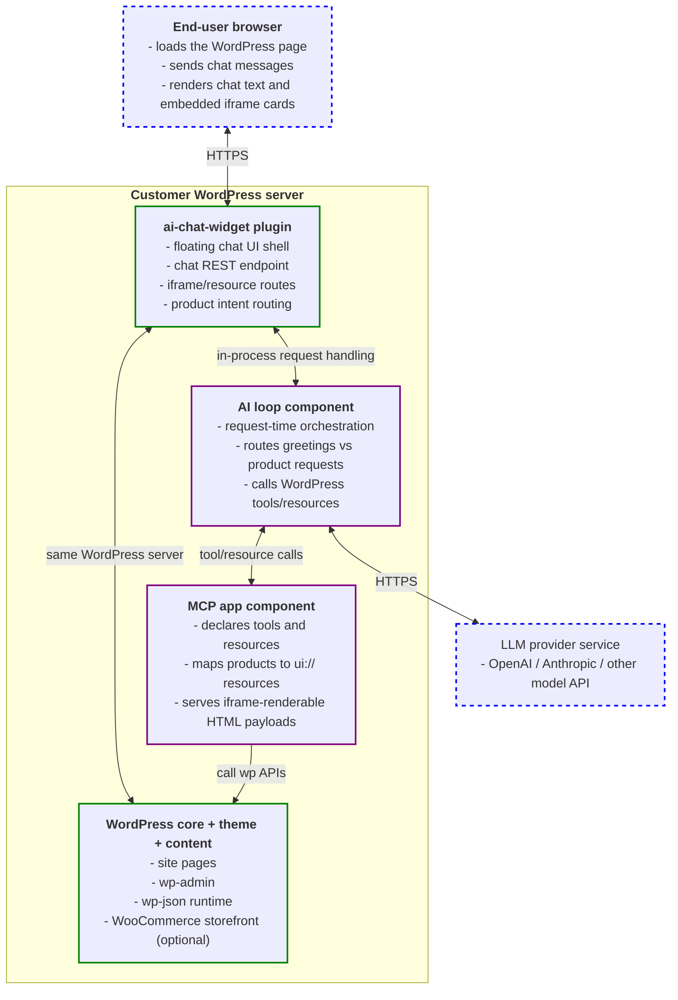
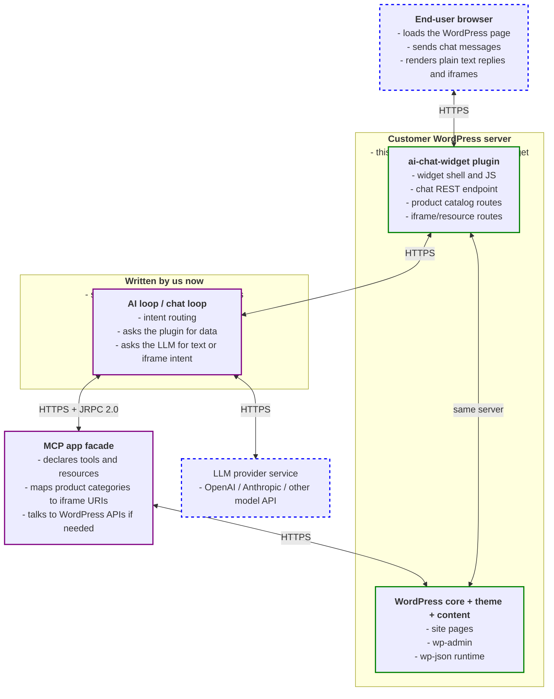
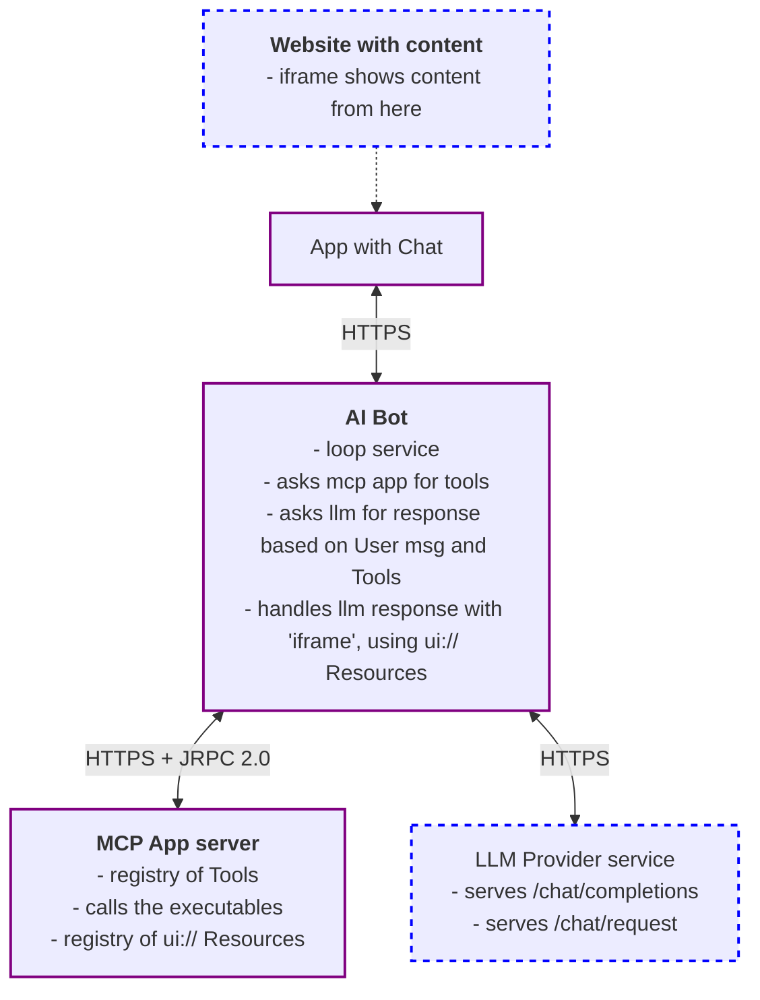

# ARCHITECTURE.md

## Architecture for ai-chat Plugin V1

This deployment view shows the production shape we are targeting for a WooCommerce-friendly WordPress install: the customer site stays in one WordPress server, the chat widget talks only to the ai-loop, and the MCP app stays behind that loop as a separate capability boundary. The LLM provider remains external.

## Architecture for ai-chat Plugin - Phase 2

This diagram shows what lives on the customer's WordPress server after deployment, what we write for the spike, and what remains external. The chat widget only communicates with the ai-loop; the ai-loop then decides whether to call tools/resources or return plain text.

If we later split the MCP app onto its own server, the current in-process MCP app should already mirror the same tool/resource boundary and serialization shape. That makes the `modelcontextprotocol/php-sdk` a likely extraction target, but it does not need to be a hard dependency yet while the MCP app remains inside WordPress.

## Appendix

Practical note: the current WordPress-hosted MCP app can stay in-process for the spike. If the MCP app becomes a dedicated server later, adopt the PHP MCP SDK at that boundary so the tool/resource contract stays stable and only the transport moves.

The Storefront Integration boundary is the local extraction seam: Demo WP and WooCommerce provide their own catalogs, MCP capability definitions, and tool executors, while the chat loop, REST contracts, and MCP app facade remain shared. The active Storefront Integration is selected by the deployment environment, so the WooTestSite1 fixture can be provisioned independently of the AI Chat plugin.

This is a tried architecture deployed for different past project, for an ai-chat interface with ability to render iframes inline the chat.

