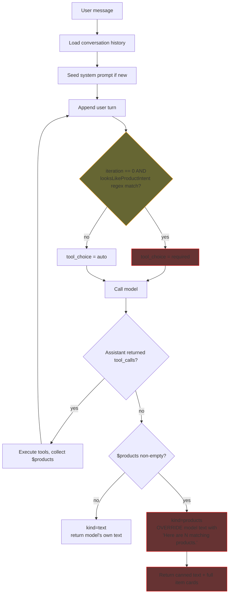
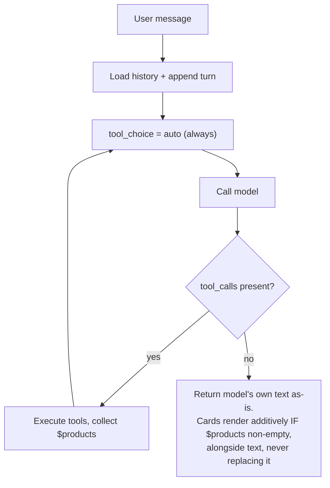
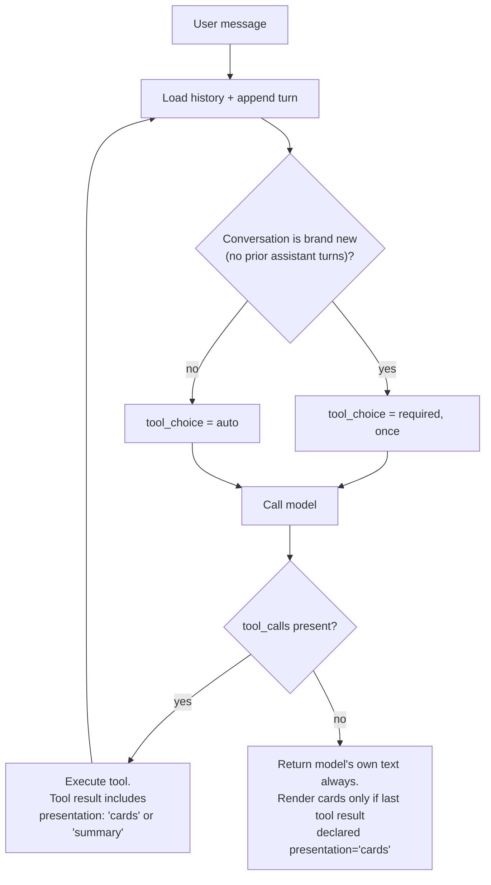
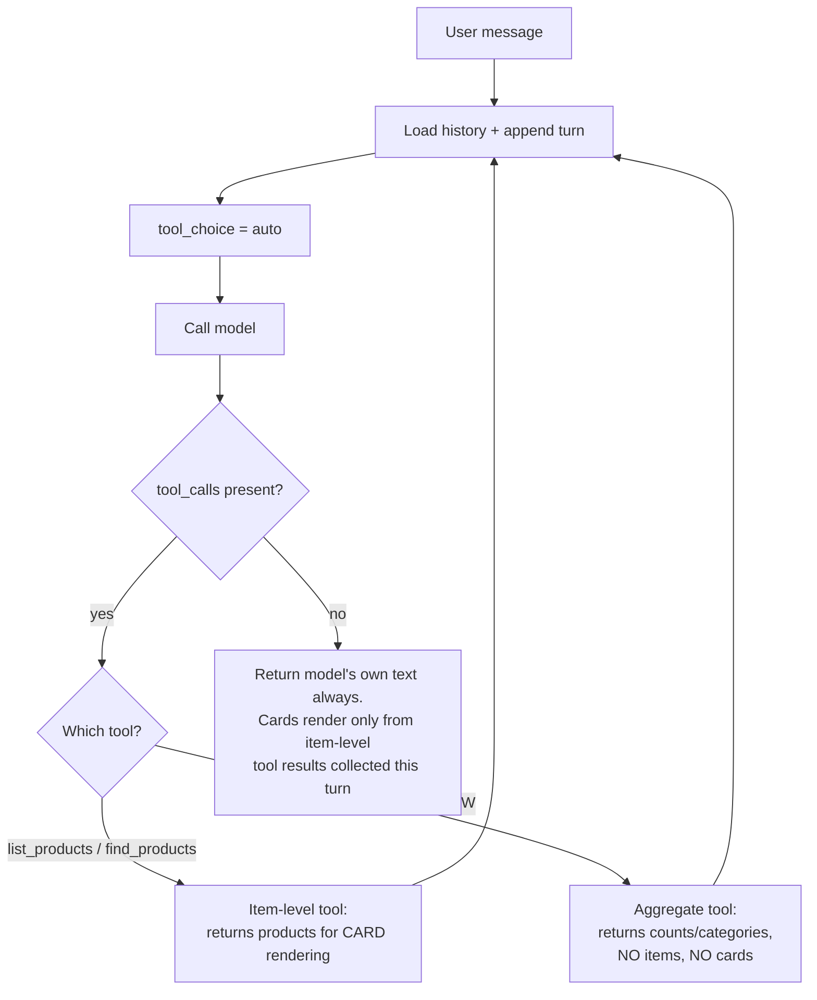

# Chat Loop Redesign — Current Flow and Alternatives

This document visualizes the current `Chat_Loop` orchestration, highlights the unhappy path
that causes meta/aggregate questions to receive canned, card-dumping answers instead of
natural-language summaries, and proposes three best-practices alternatives.

## Current flow (with unhappy path highlighted)

**Unhappy path (highlighted):** "how many product options do you offer?" matches the keyword
regex, forcing a tool call on turn 0. `list_products` returns all 5 items, the loop ends with a
non-empty `$products`, and the model's real answer (which might have said *"We offer Personal
Computers and PlayStation consoles"*) gets discarded and replaced by the canned template plus
all 5 cards, regardless of what was actually asked.

## Alternative 1 — Trust the model fully (`auto` everywhere, never override text)

Simplest possible fix: no forcing, no template override. Relies entirely on tool
descriptions and system prompt quality to get the model to call tools when appropriate.

## Alternative 2 — Cold-start nudge only, tool results carry a presentation hint

Forces a tool call only to avoid an idle cold-start UX, never again mid-conversation.
Rendering decision moves from "is array empty" to an explicit contract on the tool result.

## Alternative 3 — Add an aggregate/meta tool and separate planes strictly

Gives the model the right tool for the question instead of overloading `list_products` for
both browsing and analytics. The model naturally picks `describe_catalog` for "how many/what
categories" questions and never fetches full item cards for those.

## Recommendation

Ship Alternative 1 first (near-zero risk, fixes both reported issues today), then adopt
Alternative 3 as the durable follow-up once polished aggregate answers are desired.

**Status: Alternative 1 has been implemented.** See `includes/Services/class-chat-loop.php` and
the synced "AI Loop Flowchart" section in [ARCHITECTURE.md](../ARCHITECTURE.md).

